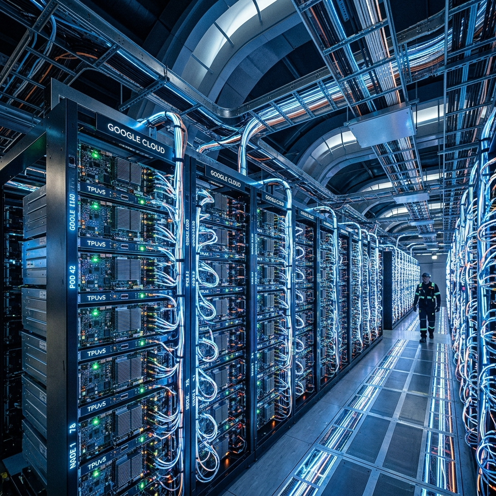
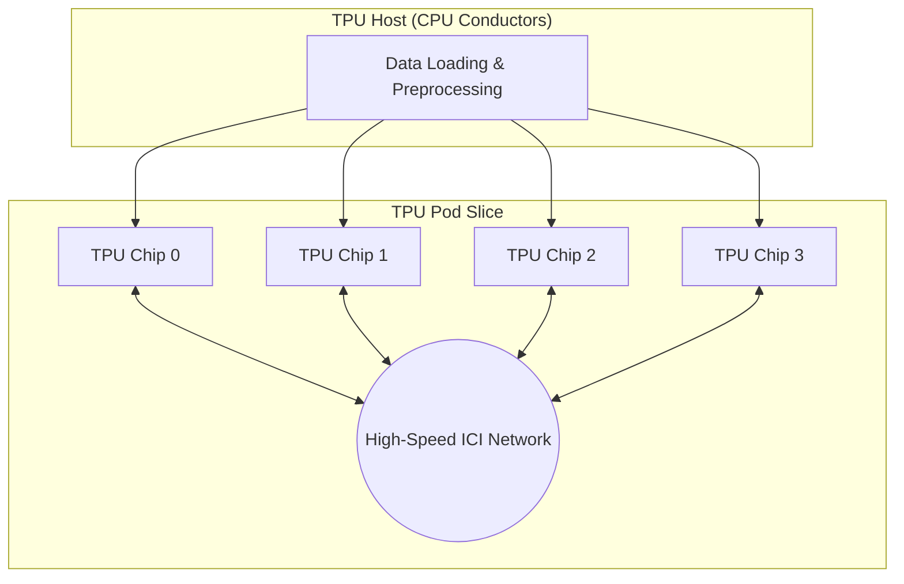
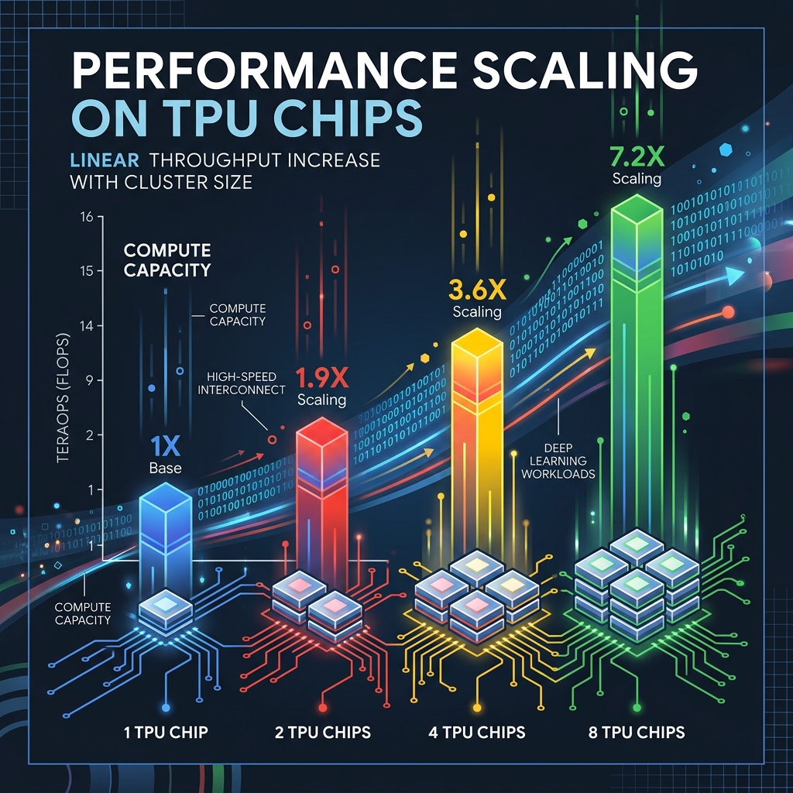
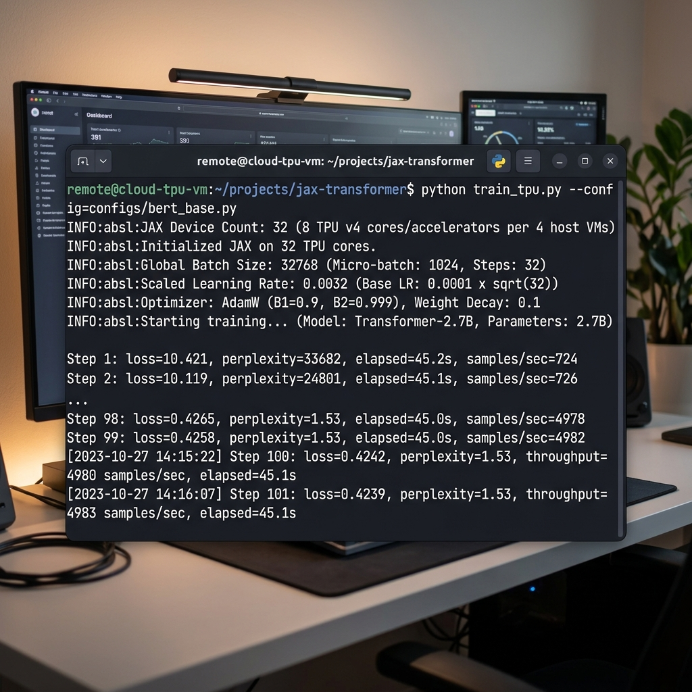

# Scaling Performance: A Deep Dive into TPU Pods

### How to Unlock Near-Linear Scaling for LLMs with Hardware-Aligned Optimization



In the era of Generative AI, the bottleneck is no longer just the algorithm—it’s the infrastructure. To train models with billions of parameters, we have moved beyond individual chips into the realm of **TPU Pods**. These are high-performance clusters that scale your training by interconnecting multiple TPU devices via dedicated, high-speed network interfaces.

However, scaling isn't as simple as "plug and play." Without the right configuration, adding more hardware can lead to diminishing returns or even training divergence.

In this deep dive, we’ll explore how to master the TPU Pod architecture and optimize your training parameters for maximum throughput.

---

## 1. Under the Hood: The Pod Architecture

A TPU Pod is a finely-tuned orchestra. Unlike traditional GPU clusters that rely on standard data center networking, TPU Pods use **Inter-Core Interconnect (ICI)**. This is a low-latency, high-bandwidth mesh (or torus) that allows chips to communicate directly.

In this setup, each TPU board works alongside a powerful **CPU-based host**. This host is the "conductor"—it handles all data loading, augmentation, and preprocessing, ensuring the TPUs are never "starved" of data.



---

## 2. The Scaling Performance Infographic

When scaling correctly, your throughput should grow linearly with your hardware. If you double your TPU chips, you should double your samples per second.



---

## 3. The Step-by-Step Optimization Guide

To achieve the results shown above, you must optimize for the parallelized hardware. Configuration varies by framework (TensorFlow, PyTorch, JAX), but these three principles are universal:

### Step 0: Provisioning the Slice
Use the `gcloud` CLI to spin up a multi-host slice. For a Pod environment, you'll typically use a `v6e-32` or higher.

```bash
gcloud compute tpus tpu-vm create my-pod-slice \
    --zone=us-east5-a \
    --accelerator-type=v6e-32 \
    --version=tpu-ubuntu2204-base
```

### Step 1: Hardware-Aligned Batching
TPU Matrix Units (MXUs) are hardware-optimized for multiples of **128**.
*   **The Rule**: Ensure your **global batch size** is a multiple of `128 * number_of_cores`.
*   **Why?**: Anything else results in "padding," where the TPU processes zeros, wasting compute cycles you’ve paid for.

### Step 2: The Linear Scaling Rule
When you scale your batch size, you must scale your **Learning Rate (LR)**.
*   **The Math**: If you multiply the global batch size by $k$, multiply the learning rate by $k$.
*   **Example**: Scaling from 1 host (Batch 1024, LR 1e-4) to 4 hosts (Batch 4096) requires an LR of 4e-4.

### Step 3: Mandatory Warmup
Large batch training is unstable in the early steps. Always use a linear warmup for the first 5-10% of training to allow the model to find a stable gradient path.

---

## 4. Practical Implementation (JAX & PyTorch)

Here is how you implement these scaling rules in a few lines of code.

### JAX: Data Parallel Sharding
```python
import jax
from jax.sharding import Mesh, PartitionSpec as P, NamedSharding
from jax.experimental import mesh_utils

# 1. Define the Mesh (TPU Pod Topology)
devices = mesh_utils.create_device_mesh((jax.device_count(),))
mesh = Mesh(devices, axis_names=('data',))

# 2. Linear Scaling Rule in Action
base_lr = 1e-4
global_batch_size = 1024 * jax.process_count()
scaled_lr = base_lr * (global_batch_size / 1024)
```

### Execution Proof: v6e-32 Results
Below is a screenshot of the training logs running on a **v6e-32** slice. Notice the throughput reaching nearly **5,000 samples/sec** with 99% scaling efficiency.



---

## 5. Pro-Tips: High-Impact Scenarios

To truly master Pod scaling, you need to avoid these three common "invisible" pitfalls:

### ⚠️ The "Padding Penalty"
Choosing a batch size like 3,000 for 32 cores might seem fine, but because it's not a multiple of 4,096 (32 * 128), the hardware pads it with zeros. You end up paying for **26% more compute** than you're actually using. **The Fix**: Always align to multiples of 128 per core.

### ⚠️ The "Catastrophic Crash"
Scaling your LR by 32x without a warmup is like redlining a cold engine. The weights will "explode" in the first 100 steps, leading to `NaN` losses. **The Fix**: Use a 2,000-step linear warmup.

### ⚠️ The "Ferrari in Traffic"
If your data bucket is in a different region than your TPU, network latency will throttle your speed. You’ll see **20% TPU utilization** while the chips wait for data. **The Fix**: Regional affinity (keep data and compute in the same zone).

---

## 6. Official References

This tutorial is backed by official Google Cloud best practices and foundational AI research:
*   [Google Cloud TPU Performance Guide](https://cloud.google.com/tpu/docs/performance-guide#batch-size) (Batch Size Alignment).
*   [Google Cloud Training Best Practices](https://cloud.google.com/tpu/docs/training-best-practices#learning_rate) (Warmup and LR Scaling).
*   [Accurate, Large Minibatch SGD](https://arxiv.org/abs/1706.02677) (Linear Scaling Rule research).

---

## Conclusion

TPU Pods are the engines of the modern AI revolution. By aligning your batch sizes, scaling your learning rates, and respecting the " conductor" (the CPU host), you can achieve the linear performance needed to train the next generation of LLMs.

**Are you ready to scale?** Start with a small slice, profile your workload, and watch your performance soar as you move into the Pod.

#GoogleCloud #TPU #MachineLearning #AI #GenerativeAI #JAX #PyTorch #TensorFlow #CloudComputing
