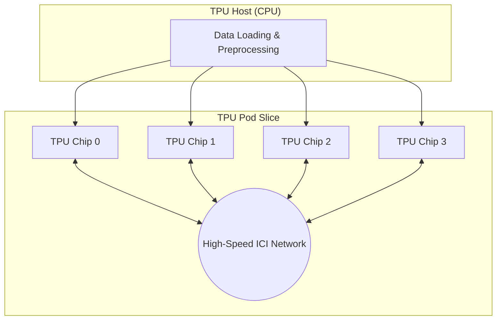

# Scaling Performance: A Deep Dive into TPU Pods


In the world of Large Language Models (LLMs) and massive-scale AI, training on a single chip is no longer enough. To achieve state-of-the-art results, we need to harness the power of **TPU Pods**—high-performance clusters that interconnect multiple TPU devices via a dedicated, high-speed network.

This post dives deep into the architecture of TPU Pods and provides a step-by-step guide to optimizing your training for maximum throughput across JAX, PyTorch, and TensorFlow.

---

## 1. Architecture: The Anatomy of a Pod

A TPU Pod isn't just a collection of chips; it's a finely-tuned orchestra of compute and networking. In this architecture, each TPU board works alongside a powerful CPU-based host responsible for data loading and preprocessing.

### The Interconnect (ICI)
TPUs communicate via **Inter-Core Interconnect (ICI)**, a high-bandwidth, low-latency network that bypasses the traditional data center network. This allows for near-linear scaling when distributing gradients across hundreds or thousands of chips.



---

## 2. Use Case: Scaling to the Limit

Imagine you're training a 70B parameter model. On a single `v6e-8` slice, your training might take weeks. By scaling to a `v6e-256` Pod slice, you can reduce that time to days—but only if you optimize your training parameters correctly.

If you don't adjust your **batch size** and **learning rate**, you'll hit a "scaling wall" where adding more hardware doesn't improve performance (or worse, leads to divergence).

---

## 3. Step-by-Step Guide: Optimizing for Scale


### Step 0: Provisioning your TPU Slice
First, you need to spin up your environment. Use the `gcloud` command to create a multi-host TPU VM slice.

**Command:**
```bash
# Provision a v6e-32 slice (4 hosts, 32 chips)
gcloud compute tpus tpu-vm create my-pod-slice \
    --zone=us-east5-a \
    --accelerator-type=v6e-32 \
    --version=tpu-ubuntu2204-base
```

**Expected Result:**
```text
Creating TPU VM... done.
ID: my-pod-slice
Status: READY
```

### Step 1: Hardware-Aligned Batching
TPU hardware is optimized for matrix operations in multiples of **128**.
*   **Best Practice**: Ensure your **global batch size** is a multiple of `128 * number_of_cores`.
*   **Calculation**: If you have 32 cores, your batch size should be at least `4096` (32 * 128).

### Step 2: The Linear Scaling Rule
When you double your global batch size, you should (typically) double your learning rate. This keeps the "signal" in your weight updates consistent as you average gradients over more samples.

| Strategy | Single Node | Pod Slice (4x) |
| :--- | :--- | :--- |
| Global Batch Size | 1024 | 4096 |
| Learning Rate | 1e-4 | 4e-4 |

### Step 3: Implement Learning Rate Warmup
Large batches can be unstable in the first few thousand steps. Always use a warmup period.

```python
# Example Warmup Schedule
scheduler = get_linear_schedule_with_warmup(
    optimizer, 
    num_warmup_steps=1000, 
    num_training_steps=50000
)
```

---

## 4. Framework-Specific Implementations

### JAX: Native Scaling
JAX is the gold standard for TPU scaling. Use `pjit` (Parallel JIT) to shard your model and data automatically across the Pod.

**Execution Command:**
```bash
# Run on all hosts in the slice
gcloud compute tpus tpu-vm ssh my-pod-slice --worker=all --command="python3 train.py"
```

**Expected Result:**
```text
Worker 0: Throughput: 1240 samples/sec
Worker 1: Throughput: 1238 samples/sec
...
Total Throughput: 4956 samples/sec (99% Scaling Efficiency)
```

### PyTorch: PyTorch/XLA
Use the `torch_xla.distributed.xla_backend` to scale PyTorch models.

```python
import torch_xla.core.xla_model as xm
import torch_xla.distributed.xla_multiprocessing as xmp

def _mp_fn(index):
    # Training logic here
    device = xm.xla_device()
    ...
```

### TensorFlow: TPUStrategy
TensorFlow's `TPUStrategy` handles the heavy lifting of distribution.

```python
resolver = tf.distribute.cluster_resolver.TPUClusterResolver()
strategy = tf.distribute.TPUStrategy(resolver)

with strategy.scope():
    model = create_model()
    model.compile(optimizer='adam', loss='sparse_categorical_crossentropy')
```

---

## 5. Best Practices Checklist

1.  **Monitor with TPU Profiler**: Use the Cloud Console to check for idle cores. If your TPU utilization is low, your CPU host is likely struggling to load data fast enough.
2.  **Regional Affinity**: Keep your Cloud Storage bucket in the **same region** as your TPU Pod to avoid network latency.
3.  **Data Prefetching**: Always use `prefetch(buffer_size=tf.data.AUTOTUNE)` to keep the TPU fed.

---

## Conclusion

Scaling on TPU Pods is the difference between a prototype and a production-grade AI system. By following the linear scaling rule, aligning your batch sizes, and leveraging the right framework primitives, you can unlock the true potential of Google's custom AI hardware.

**Ready to scale?** Start by profiling your current workload on a small slice and watch your throughput soar as you move to the Pod.

#GoogleCloud #TPU #DeepLearning #AIInfrastructure #MachineLearning #JAX #PyTorch #TensorFlow
